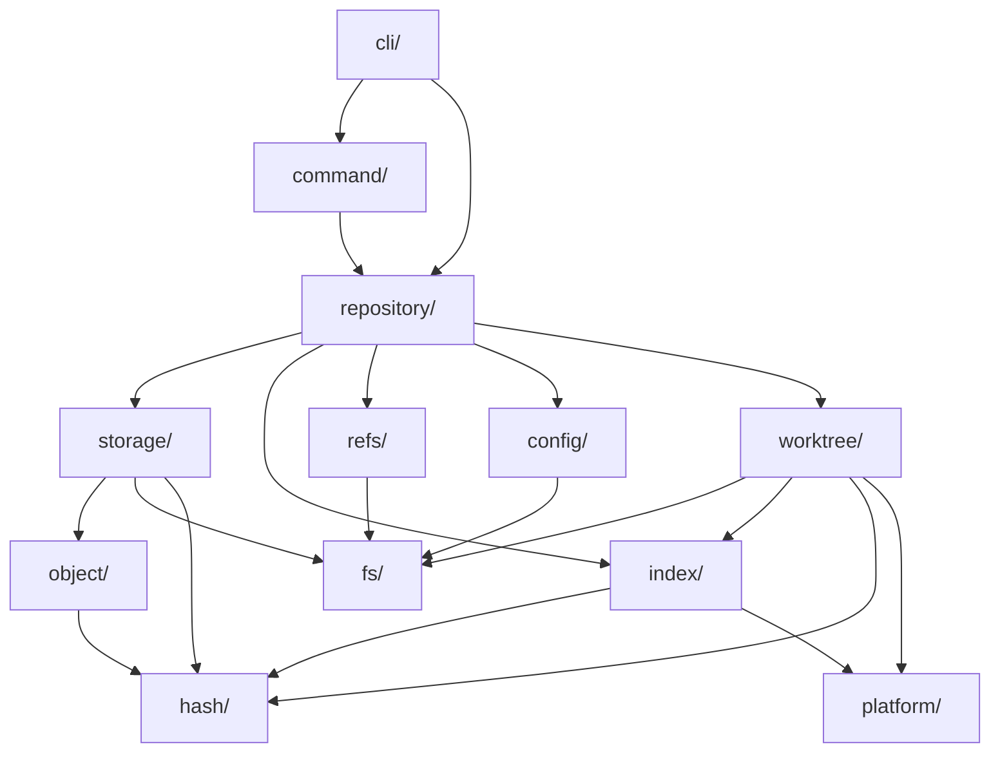

# Purr — Architecture Redesign

**Date:** 2026-05-28 · **Status:** Proposal

---

## 1. What's Wrong With The Current Structure

```
internal/
├── purrCommands/        ← command logic + OS calls + concurrency + path construction + index I/O
│   ├── Add.go           ← owns goroutine pool, mutex, filepath.Join(".purr","index"), os.Stat
│   ├── Commit.go        ← owns zlib compression, tree building, HEAD resolution
│   ├── Config.go
│   ├── Init.go          ← Windows syscalls without build tags
│   └── LsFiles.go
└── utils/               ← everything else dumped here
    ├── commitFunctions.go  ← tree objects + commit objects + HEAD + branch refs + config check
    ├── config.go           ← global config I/O
    ├── index.go            ← binary index serialization
    ├── shaFunctions.go     ← blob hashing + tree hashing
    ├── types.go            ← all types for everything
    └── utils.go            ← file walk + object store + stat population + HEAD read/write
```

### Diagnosis

| Problem | Where | Why it hurts |
|---|---|---|
| **God package** | `utils/` has 6 files doing 8+ unrelated things | Can't test hashing without pulling in filesystem, HEAD, config, index |
| **No abstraction boundary** | `Add.go` directly calls `os.Stat`, `filepath.Join(".purr",...)`, `os.Getwd()` | Can't test add logic without a real filesystem |
| **Platform code mixed with core** | `utils.go:83` casts to `Win32FileAttributeData`, `Init.go` calls Windows syscalls | Won't compile cross-platform |
| **Concurrency in business logic** | `Add.go` owns goroutine pool, semaphore, mutex | Can't change concurrency strategy without editing command logic |
| **Path construction scattered** | 27 separate `filepath.Join(".purr", ...)` calls across 8 files | One rename of `.purr` requires editing every file |
| **No repository object** | Every function independently resolves paths relative to CWD | No way to operate on a repo from a subdirectory or test with a temp dir |
| **Duplicate functions** | `GetHEADCommit` / `GetParentCommit`, `UpdateHEAD` / `UpdateBranchRef` | Will inevitably drift |
| **Types for everything in one file** | `IndexEntry`, `CommitObj`, `TreeEntries`, `PurrConfig`, `Index` all in `types.go` | Index types coupled to commit types coupled to config types |

**The root cause:** There's no domain model. Code is organized by "command" vs "not command" instead of by responsibility.

---

## 2. Proposed Structure

```
Persephone/
├── cmd/
│   └── purr/
│       └── main.go                  # Entrypoint only: cmd.Execute()
│
├── cli/                             # Cobra command definitions (porcelain)
│   ├── root.go
│   ├── init.go
│   ├── add.go
│   ├── commit.go
│   ├── config.go
│   └── ls_files.go
│
├── internal/
│   ├── repository/                  # Central repo handle — the spine of the system
│   │   ├── repository.go            # Repository struct, Open(), Init(), path resolution
│   │   └── repository_test.go
│   │
│   ├── object/                      # Object model (blob, tree, commit) — pure data + serialization
│   │   ├── blob.go                  # Blob type, header format, serialize/deserialize
│   │   ├── tree.go                  # Tree type, entry sorting, binary tree format
│   │   ├── commit.go               # Commit type, text format, parent chain
│   │   ├── object.go               # Common Object interface, OID type
│   │   └── *_test.go
│   │
│   ├── storage/                     # Object database — content-addressable store
│   │   ├── backend.go              # ObjectStore interface
│   │   ├── loose.go                # Loose object read/write (.purr/objects/xx/yy)
│   │   ├── loose_test.go
│   │   └── compress.go             # zlib compress/decompress helpers
│   │
│   ├── index/                       # Staging area — binary index format
│   │   ├── index.go                # Index struct, Add/Remove/Lookup operations
│   │   ├── entry.go                # IndexEntry type + stat cache fields
│   │   ├── codec.go                # Binary serialization (read/write DIRC format)
│   │   └── *_test.go
│   │
│   ├── refs/                        # Reference management — HEAD, branches, tags
│   │   ├── refs.go                 # RefStore interface + filesystem implementation
│   │   ├── head.go                 # HEAD resolution (symbolic ref vs detached)
│   │   └── *_test.go
│   │
│   ├── worktree/                    # Working tree operations
│   │   ├── worktree.go             # Walk, diff against index, stage files
│   │   ├── ignore.go               # .purrignore pattern matching
│   │   └── status.go               # Working tree status (modified/untracked/deleted)
│   │
│   ├── config/                      # Configuration system
│   │   ├── config.go               # Config struct, read/write
│   │   └── config_test.go
│   │
│   ├── command/                     # Command implementations (plumbing)
│   │   ├── init.go                 # Init logic (no CLI, no OS awareness)
│   │   ├── add.go                  # Add logic (receives repo handle, no concurrency)
│   │   ├── commit.go               # Commit logic
│   │   └── ls_files.go
│   │
│   ├── hash/                        # Hashing abstraction
│   │   └── hash.go                 # OID type, HashObject(), currently SHA-1, swappable later
│   │
│   ├── platform/                    # ALL OS-specific code lives here
│   │   ├── stat_linux.go           # //go:build linux — Stat_t extraction
│   │   ├── stat_darwin.go          # //go:build darwin
│   │   ├── stat_windows.go         # //go:build windows — Win32FileAttributeData
│   │   ├── hidden_windows.go       # //go:build windows — SetFileAttributes
│   │   ├── hidden_unix.go          # //go:build !windows — no-op
│   │   ├── lock.go                 # File locking (fcntl on unix, LockFileEx on windows)
│   │   └── filemode.go             # Executable bit detection per platform
│   │
│   └── fs/                          # Filesystem abstraction layer
│       ├── fs.go                   # FS interface: Read, Write, Stat, MkdirAll, Rename, Lock
│       ├── osfs.go                 # Real filesystem implementation
│       ├── memfs.go                # In-memory FS for testing
│       └── atomic.go               # AtomicWrite: write-to-temp → fsync → rename
│
├── DOCS/
├── Makefile
├── go.mod
└── README.md
```

---

## 3. Package Responsibilities

### Leaf packages (no internal imports)

| Package | Owns | Exports |
|---|---|---|
| `hash` | OID type, hashing algorithm | `type OID [20]byte`, `Hash([]byte) OID`, `OIDFromHex(string) OID` |
| `platform` | All `//go:build` tagged code | `ExtractStat(os.FileInfo) StatData`, `SetHidden(path)`, `AcquireLock(path)` |
| `fs` | Filesystem I/O abstraction | `type FS interface`, `NewOSFS()`, `NewMemFS()`, `AtomicWrite()` |

### Core domain packages

| Package | Owns | Imports |
|---|---|---|
| `object` | Blob/Tree/Commit **types and serialization** — no I/O | `hash` |
| `index` | IndexEntry type, binary codec, in-memory index operations | `hash`, `platform` (for stat fields) |
| `storage` | Reading/writing objects to disk | `hash`, `object`, `fs` |
| `refs` | HEAD resolution, branch pointer updates | `fs` |
| `config` | Config struct, JSON serialization, path resolution | `fs` |
| `worktree` | File walking, ignore patterns, status diffing | `fs`, `index`, `hash`, `platform` |

### Orchestration layer

| Package | Owns | Imports |
|---|---|---|
| `repository` | Repo struct that wires everything together — holds `FS`, `ObjectStore`, `Index`, `RefStore` | All core packages |
| `command` | Stateless functions that take a `*Repository` and execute plumbing logic | `repository` |

### CLI layer

| Package | Owns | Imports |
|---|---|---|
| `cli` | Cobra command definitions, flag parsing, output formatting, `os.Exit` | `command`, `repository` |

---

## 4. Dependency Rules



**Hard rules:**

1. **Nothing imports `cli/`** — it's the outermost layer
2. **`object/` does zero I/O** — pure types + serialization + hashing
3. **`command/` never calls `os.*` directly** — everything through `repository`
4. **`platform/` is never imported by `cli/` or `command/`** — only by low-level packages that need OS-specific behavior
5. **`fs/` never imports any internal package** — it's a leaf dependency
6. **No package imports `repository/` except `command/` and `cli/`** — prevents circular deps

---

## 5. Key Interfaces

```go
// fs/fs.go — abstracts all filesystem I/O
type FS interface {
    ReadFile(path string) ([]byte, error)
    WriteFile(path string, data []byte, perm os.FileMode) error
    AtomicWrite(path string, data []byte, perm os.FileMode) error  // temp+fsync+rename
    Stat(path string) (os.FileInfo, error)
    MkdirAll(path string, perm os.FileMode) error
    Remove(path string) error
    Walk(root string, fn filepath.WalkFunc) error
    Lock(path string) (Unlocker, error)   // file-based locking
}
```

```go
// storage/backend.go — object database
type ObjectStore interface {
    Read(oid hash.OID) (object.Object, error)
    Write(obj object.Object) (hash.OID, error)
    Exists(oid hash.OID) bool
}
```

```go
// refs/refs.go — reference storage
type RefStore interface {
    ReadHEAD() (string, error)               // returns ref name or OID
    ResolveHEAD() (hash.OID, error)          // follows symbolic refs
    UpdateRef(name string, oid hash.OID) error
}
```

```go
// repository/repository.go — the central handle
type Repository struct {
    RootDir    string
    FS         fs.FS
    Objects    storage.ObjectStore
    Index      *index.Index
    Refs       refs.RefStore
    Config     *config.Config
}

func Open(path string) (*Repository, error)    // find .purr, wire deps
func Init(path string) (*Repository, error)    // create .purr, wire deps
```

**Why these interfaces matter:**
- `FS` → swap real disk for in-memory in tests. No temp dirs needed.
- `ObjectStore` → can later add packfile backend without changing any command code
- `RefStore` → can later add reflog without touching commit logic
- `Repository` → commands get a single dependency instead of 6 scattered function calls

---

## 6. What Must Be Redesigned Before Scaling

Ordered by priority. Do these before adding any new commands.

### 6.1 Platform isolation (blocks: building on Linux at all)

Extract `PopulateAllIndexField` into `platform/stat_{os}.go` files. Extract `Init.go` Windows hidden-file logic into `platform/hidden_{os}.go`. Add build tags. This is prerequisite to everything else because **the project doesn't compile on Linux**.

### 6.2 Repository handle (blocks: every other refactor)

Create `repository.Repository` that holds root path and resolves all `.purr/` paths. Currently 27 scattered `filepath.Join(".purr", ...)` calls make every function implicitly depend on CWD. A repo handle eliminates this and enables:
- Running commands from subdirectories
- Testing with temp directories
- Future multi-repo operations

### 6.3 FS abstraction + atomic writes (blocks: data safety)

Create `fs.FS` interface. Wrap all `os.ReadFile`/`os.WriteFile` calls. Implement `AtomicWrite` (write temp → fsync → rename). This fixes AUDIT finding C2 across the entire codebase in one shot.

### 6.4 Object model separation (blocks: correct tree building)

Move blob/tree/commit types and serialization into `object/`. Currently `BuildTreeObject` and `BuildCommitObject` live in `commitFunctions.go` next to `GetParentCommit` and `CheckConfigFile`. These have completely different responsibilities and change for different reasons.

### 6.5 Concurrency extraction (blocks: testability of add logic)

The goroutine pool in `Add.go` is tangled with business logic (stat checking, index lookup, blob writing). Extract the "what to do per file" logic into a pure function, then wrap it in a generic concurrent executor that the command invokes. The command shouldn't own `sync.Mutex` or `chan struct{}`.

### 6.6 Delete dead code

`GetParentCommit`, `UpdateBranchRef`, `Index` struct in types.go, `TreeEntries.Filename` field — all unused. Remove before they confuse future contributors.

---

## 7. Migration Path

You don't need to do this all at once. Here's the order that minimizes breakage:

```
Phase 1: Compile on all platforms
  └─ Create platform/ with build tags
  └─ Move Win32 stat + hidden file logic
  └─ Verify: `go build` on Linux

Phase 2: Central repository handle
  └─ Create repository.Repository with root path + path helpers
  └─ Thread it through existing commands (replace bare path strings)
  └─ No interface changes yet, just consolidate path resolution

Phase 3: FS abstraction
  └─ Create fs.FS interface + osfs implementation
  └─ Inject into Repository
  └─ Implement AtomicWrite, use it in index.WriteIndex + storage

Phase 4: Separate domain packages
  └─ Move types into their owning packages (IndexEntry → index/, CommitObj → object/)
  └─ Move serialization with them
  └─ Move storage (StoreObject, loose object layout) into storage/

Phase 5: Extract command logic
  └─ Move command business logic from purrCommands/ to command/
  └─ Commands take *Repository, return errors — no os.Exit, no fmt.Print
  └─ CLI layer handles output formatting and exit codes

Phase 6: Worktree + concurrency
  └─ Create worktree/ for file walking and status
  └─ Build concurrent file processor as reusable utility
  └─ Add.go becomes: resolve files → worktree.Walk → concurrent hash → index.Update
```

Each phase compiles and works independently. No big-bang rewrite.

---

## 8. Current → Proposed File Mapping

| Current file | Goes to | Notes |
|---|---|---|
| `cmd/purr/main.go` | `cmd/purr/main.go` | No change |
| `cmd/root.go` | `cli/root.go` | Rename package |
| `cmd/add.go` | `cli/add.go` | Thin Cobra wrapper only |
| `cmd/commit.go` | `cli/commit.go` | Remove `utils` import |
| `cmd/init.go` | `cli/init.go` | |
| `cmd/config.go` | `cli/config.go` | |
| `cmd/ls-files.go` | `cli/ls_files.go` | |
| `purrCommands/Add.go` | `command/add.go` + `worktree/worktree.go` | Split: logic vs tree walking |
| `purrCommands/Commit.go` | `command/commit.go` | Remove zlib, tree building |
| `purrCommands/Config.go` | `command/config.go` | |
| `purrCommands/Init.go` | `command/init.go` + `platform/hidden_*.go` | Split: logic vs Windows API |
| `purrCommands/LsFiles.go` | `command/ls_files.go` | |
| `utils/types.go` | Split: `index/entry.go`, `object/commit.go`, `object/tree.go`, `config/config.go` | Each type goes to its domain |
| `utils/index.go` | `index/codec.go` | |
| `utils/shaFunctions.go` | `hash/hash.go` + `storage/loose.go` | Split: hashing vs storing |
| `utils/commitFunctions.go` | `object/tree.go`, `object/commit.go`, `refs/head.go` | Split by responsibility |
| `utils/config.go` | `config/config.go` | |
| `utils/utils.go` | Split: `storage/loose.go`, `platform/stat_*.go`, `refs/head.go`, `worktree/worktree.go` | God file decomposed |
