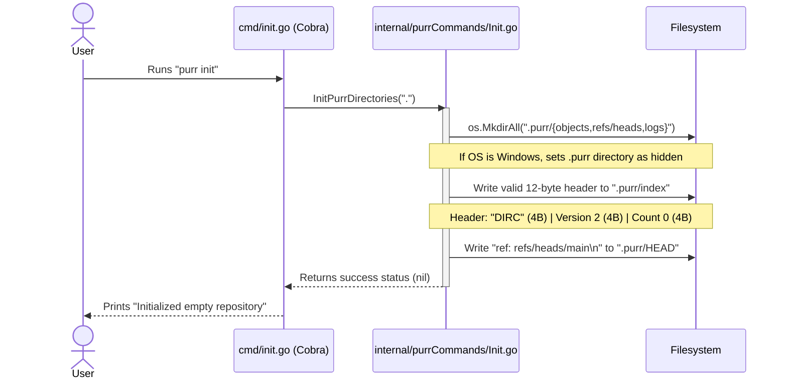
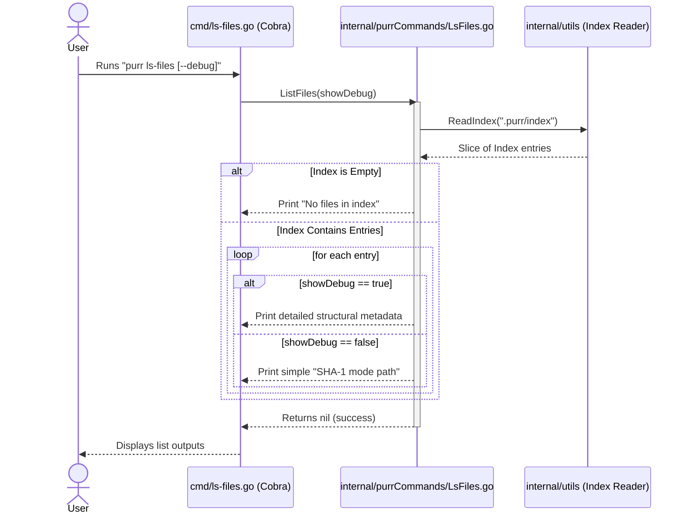
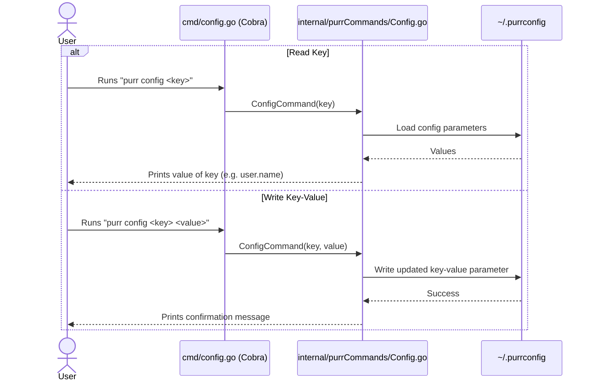
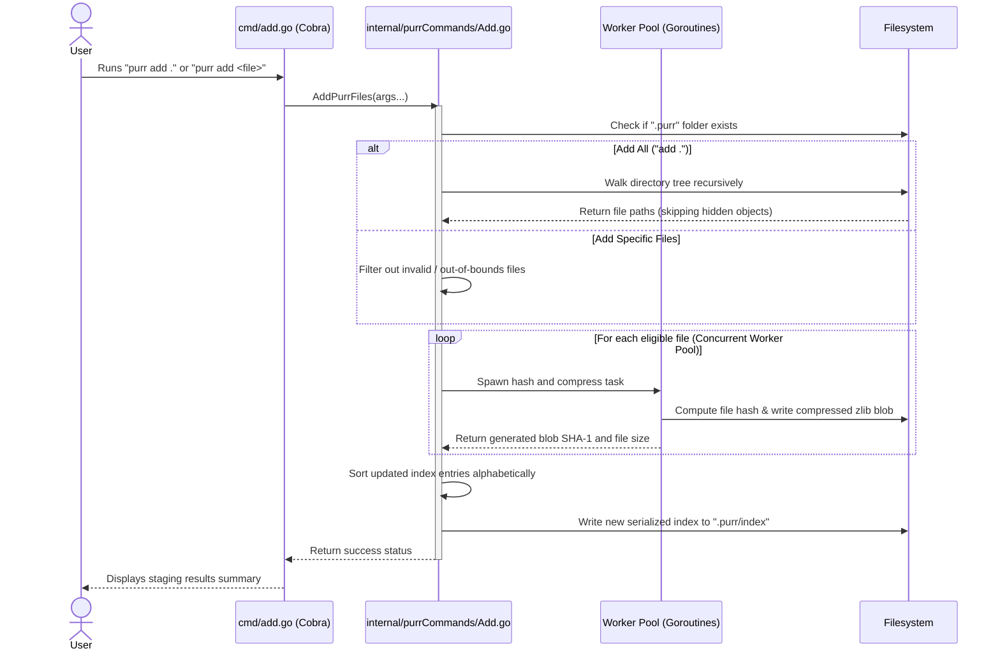
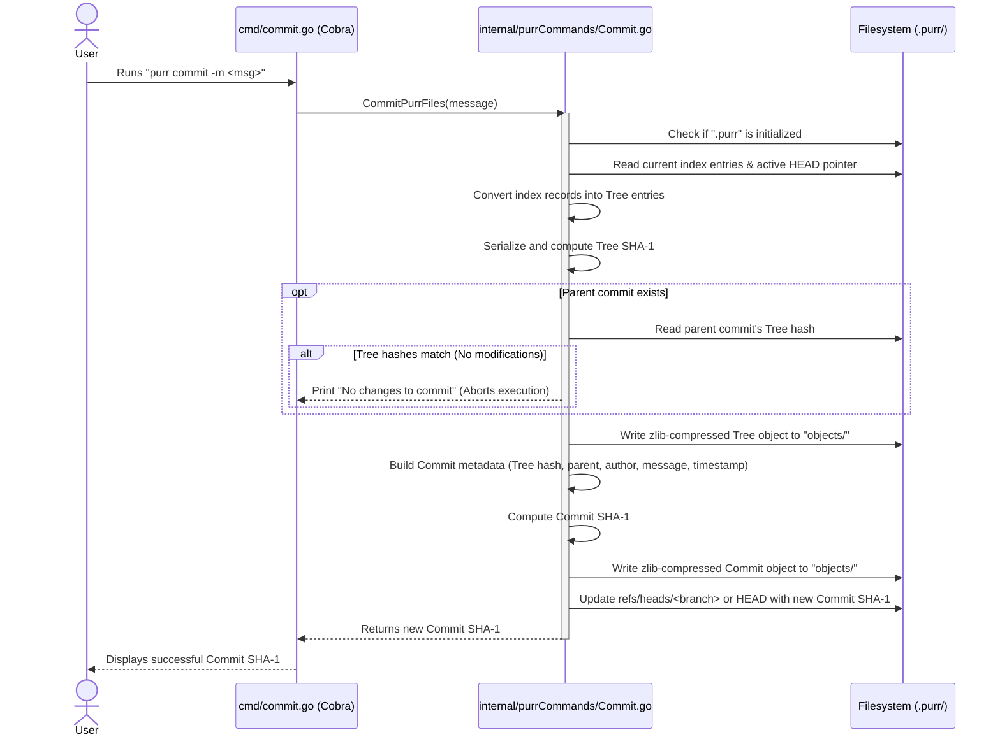

# Purr Commands: Implementation Guide & Architectural Flows

This document details the software design, sequence flows, and internal implementations of each custom **Purr** command.

---

## 1. `purr init`

Initializes a local repository with the necessary directory hierarchy and metadata configuration.

### Sequence Flow

### Detailed Steps

1. **Invocation**: The user executes `purr init`. The runtime invokes the entrypoint in `cmd/init.go`.
2. **Directory Bootstrapping**: Core calls `InitPurrDirectories(".")` inside `internal/purrCommands/Init.go`. It builds:
   - `.purr/objects` (object store)
   - `.purr/refs/heads` (local refs)
   - `.purr/logs` (lifecycle history logs)
3. **OS-Specific Adjustments**: On Windows platforms, `.purr` is set to "hidden" using syscalls.
4. **Staging Index Creation**: Writes a valid 12-byte binary index header if the file is missing:
   - Magic signature: `"DIRC"` (4 bytes)
   - Staging Version: `2` (4 bytes, big-endian)
   - Initial count of entries: `0` (4 bytes, big-endian)
5. **HEAD Initialization**: Writes `"ref: refs/heads/main\n"` to `.purr/HEAD`, binding active tracking to the `main` branch.

---

## 2. `purr ls-files`

Lists all files currently tracked in the staging index.

### Sequence Flow

### Detailed Steps

1. **Invocation**: The user executes `purr ls-files [--debug]`.
2. **Loading Index**: The CLI calls `ListFiles(showDebug)` in `internal/purrCommands/LsFiles.go`. It reads the binary database under `.purr/index` using the `utils.ReadIndex` library helper.
3. **Empty Bounds Handling**: If the index contains `0` records, the command exits with `"No files in index"`.
4. **Output Rendering**:
   - **Default Mode**: Displays the calculated object hash, file mode, and relative path.
   - **Debug Mode**: Prints detailed binary index records, including timestamps (`mtime`, `ctime`), host attributes (`dev`, `ino`, `uid`, `gid`), file sizes, and stage parameters.

---

## 3. `purr config`

Manages configuration files on the local machine.

### Sequence Flow

### Detailed Steps

1. **Invocation**: The user executes `purr config <key> [value]`.
2. **CLI Routing**: Handles read or write modes depending on the argument length:
   - **Read Mode** (1 argument): Invokes `utils.ReadConfig()` to load the global configuration file (`~/.purrconfig`) and outputs the value of the requested key (typically `user.name` or `user.email`).
   - **Write Mode** (2+ arguments): Loads current configs (or builds a new configuration if missing), modifies the key, and writes the changes back to `~/.purrconfig`.

---

## 4. `purr add`

Walks directories concurrently and stages new or modified files in the `.purr` index.

### Sequence Flow

### Detailed Steps

1. **Invocation**: The user runs `purr add .` or `purr add file1.txt`.
2. **Directory Checks**: Core calls `AddPurrFiles(args...)` from `internal/purrCommands/Add.go`, validating that the directory has been initialized with a `.purr` storage root.
3. **Workspace Traversal**:
   - **Staging All**: Walks the current directory recursively using optimized walk steps that skip hidden folders and `.purr` contents.
   - **Staging Specific Paths**: Collects the files listed in the arguments, filtering out missing objects, folders, and out-of-bounds files.
4. **Concurrent Hashing (Worker Pool)**: For modified or new files, tasks are distributed to a concurrent worker pool:
   - Calculates the `SHA-1` checksum of the file's raw content.
   - Writes a zlib-compressed blob object to `.purr/objects/XX/YYYY...` only if the file content has changed.
5. **Index Serialization**: Integrates new file entries, sorts the index collection alphabetically by path, and performs an atomic write to `.purr/index`.

---

## 5. `purr commit`

Generates an immutable commit snapshot containing the staged workspace states.

### Sequence Flow

### Detailed Steps

1. **Invocation**: The user executes `purr commit -m "commit message"`.
2. **Metadata Setup**: Extracts current stage data from `.purr/index` and fetches the parent commit reference by reading the local branch ref pointed to by `.purr/HEAD`.
3. **Tree Object Assembly**:
   - Groups index files into directory entries.
   - Serializes folders into standard Tree format entries.
   - Computes the Tree `SHA-1` hash.
4. **Deduplication Validation**: Compares the new Tree hash with the parent commit's Tree hash. If they are identical, the commit is aborted since no changes have been staged.
5. **Write Objects**:
   - Writes the compressed Tree object into the database.
   - Generates Commit metadata (Tree hash, Parent hash, Author name/email, message, and timestamp).
   - Computes the Commit `SHA-1` hash.
   - Writes the compressed Commit object into the database.
6. **Updating Refs**: Updates the target branch pointer (e.g., `.purr/refs/heads/main`) to point to the new commit's `SHA-1` hash.