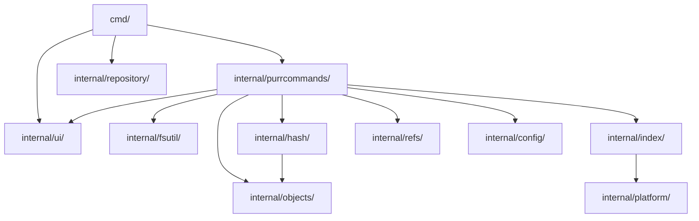
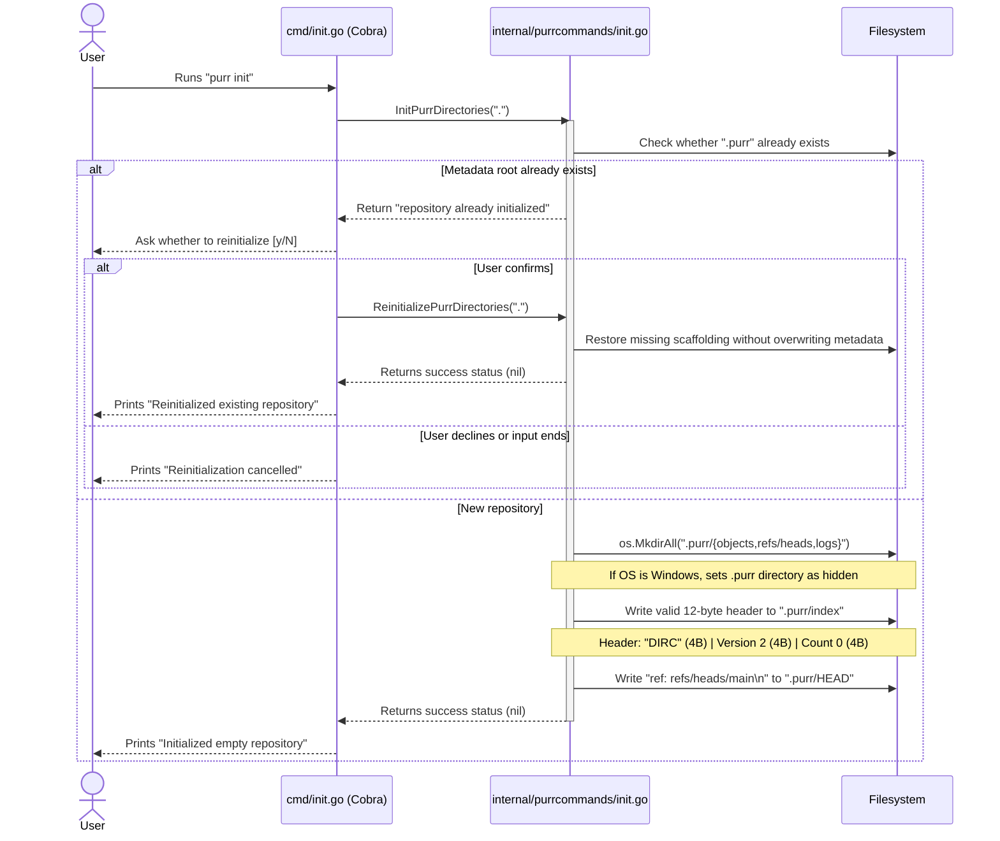
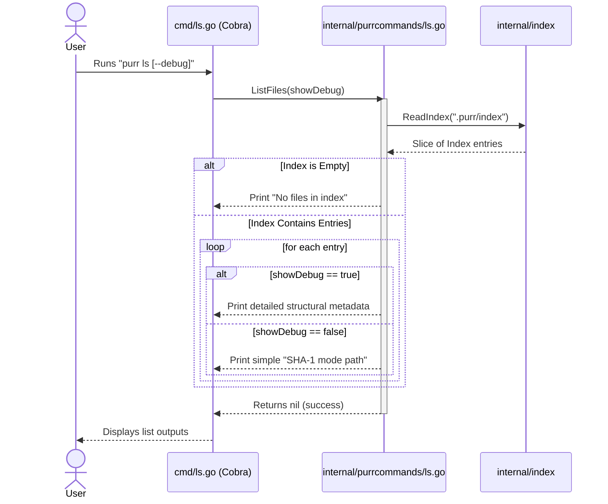
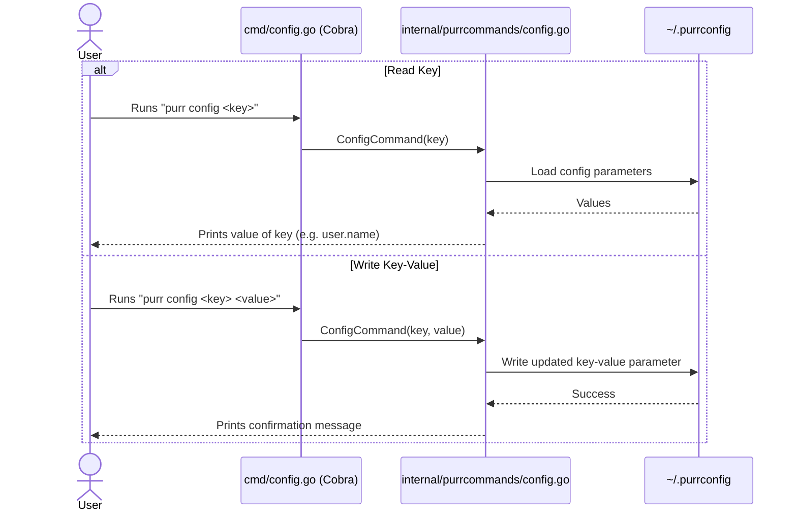
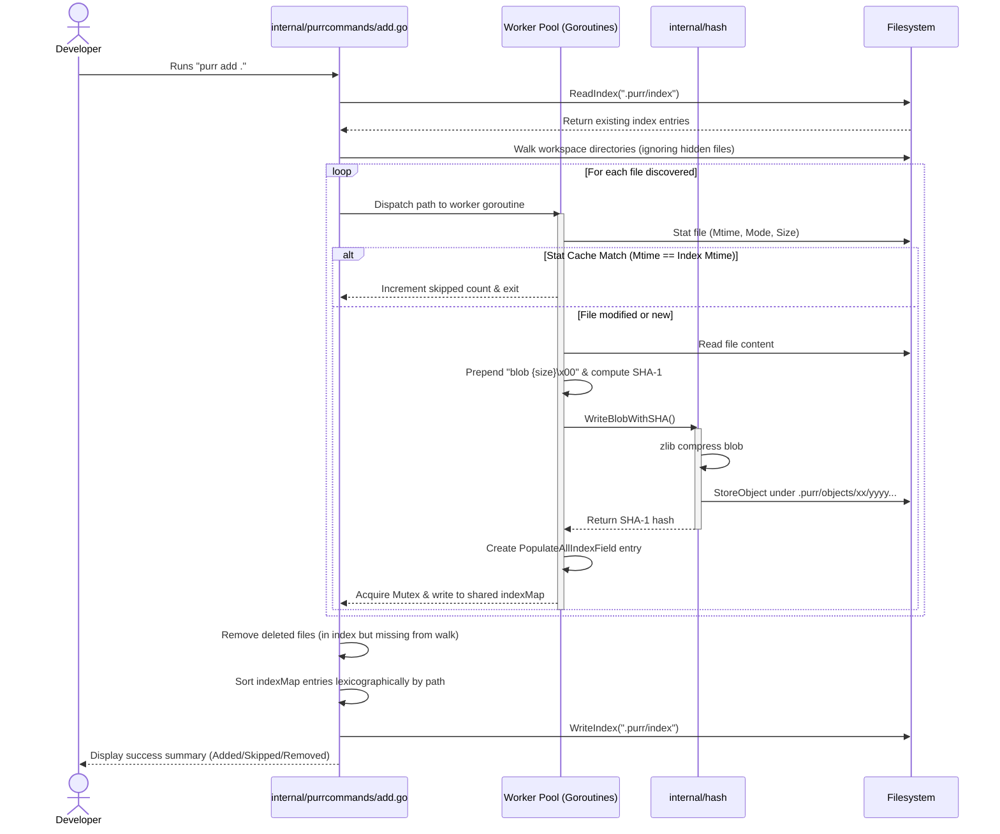
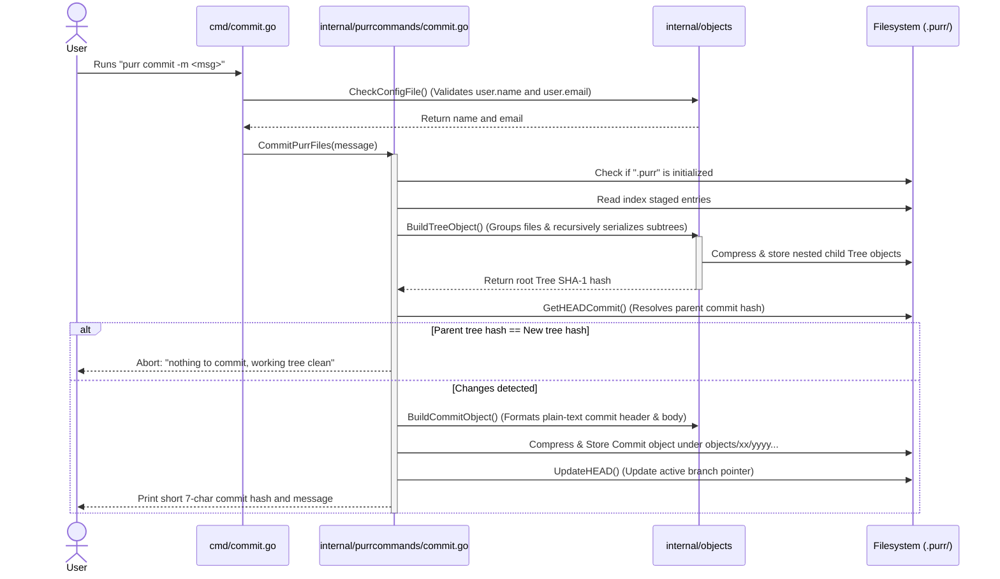

# Purr — Architecture Design & Sequence Flows

This document details the software design, sequence flows, and internal implementations of each custom **Purr** command.

---

## 1. Package Structure

```
persephone/
├── cmd/                             # Cobra command definitions (porcelain)
│   ├── purr/
│   │   └── main.go                  # CLI binary entry point
│   ├── add.go                       # Cobra 'add' command definition
│   ├── commit.go                    # Cobra 'commit' command definition
│   ├── config.go                    # Cobra 'config' command definition
│   ├── init.go                      # Cobra 'init' command definition
│   ├── log.go                       # Cobra 'log' command definition
│   ├── ls.go                        # Cobra 'ls' command definition
│   ├── remove.go                    # Cobra 'remove' command definition
│   └── root.go                      # Cobra root command definition
│
├── internal/
│   ├── config/                      # Configuration management
│   │   ├── config.go                # Read/write user configuration
│   │   └── types.go                 # Configuration types
│   │
│   ├── fsutil/                      # Filesystem utilities
│   │   └── fsutil.go                # File existence and traversal walking
│   │
│   ├── hash/                        # Hashing and compression
│   │   └── shaFunctions.go          # Blob and tree hashing, zlib writes
│   │
│   ├── index/                       # Staging area index management
│   │   ├── index.go                 # Binary index codec (DIRC reader/writer)
│   │   ├── types.go                 # Staging index structures
│   │   └── utils.go                 # Index population helpers
│   │
│   ├── objects/                     # Git-compatible objects representation
│   │   ├── commitFunctions.go       # Commit & Tree serialization and verification
│   │   ├── store.go                 # Content-addressed storage (zlib compression)
│   │   └── types.go                 # Object structures
│   │
│   ├── platform/                    # Platform-specific OS attributes and stat extraction
│   │   ├── hidden_unix.go
│   │   ├── hidden_windows.go
│   │   ├── stat.go
│   │   ├── stat_darwin.go
│   │   ├── stat_linux.go
│   │   └── stat_windows.go
│   │
│   ├── purrcommands/                # CLI Command implementation logic (plumbing)
│   │   ├── add.go
│   │   ├── commit.go
│   │   ├── config.go
│   │   ├── init.go
│   │   ├── log.go
│   │   ├── ls.go
│   │   └── remove.go
│   │
│   ├── refs/                        # Reference management
│   │   └── refs.go                  # HEAD resolution and branch updates
│   │
│   ├── repository/                  # Repository handle
│   │   └── repository.go            # Path resolution and validation
│   │
│   ├── testutils/                   # Test configuration helpers
│   │   └── helpers.go
│   │
│   └── ui/                          # Styled terminal rendering components
│       ├── components.go
│       └── styles.go
│
├── Docs/
├── Makefile
├── go.mod
└── README.md
```

---

## 2. Package Responsibilities

| Package | Owns | Imports |
|---|---|---|
| `cmd/` | Cobra command definitions, flag parsing, output formatting, exit handlers | `internal/purrcommands`, `internal/objects`, `internal/ui` |
| `internal/config` | Global configuration loading/writing (`~/.purrconfig`) | Standard library |
| `internal/fsutil` | File existence checks and workspace directory crawling | Standard library |
| `internal/hash` | Content-addressed SHA-1 hashing, blob/tree serialization and zlib storage orchestration | `internal/objects` |
| `internal/index` | Staging area catalog codec, stat cache checking, binary DIRC parser | `internal/platform` |
| `internal/objects` | Git-compatible VCS object builders (Blob, Tree, Commit), commit verification and loose store I/O | `internal/config` |
| `internal/platform` | Low-level OS-specific stat attributes mapping and hidden attributes management via build tags | Standard library |
| `internal/purrcommands` | Core execution flow engine for every VCS subcommand (add, commit, config, init, log, ls, remove) | `internal/config`, `internal/index`, `internal/objects`, `internal/refs`, `internal/fsutil`, `internal/hash`, `internal/ui` |
| `internal/refs` | Reference pointer storage (HEAD reading/writing, symbolic branch reference updates) | Standard library |
| `internal/repository` | Central repository handle, repository folder paths mapping and verification | Standard library |
| `internal/ui` | Lipgloss-based terminal styles and components for user output | `github.com/charmbracelet/lipgloss`, `github.com/charmbracelet/bubbles` |

---

## 3. Dependency Rules



**Hard rules:**

1. **Nothing imports `cmd/`** — it's the outermost layer.
2. **`internal/ui/` is imported only for terminal representation** and styling.
3. **`internal/platform/` is selected by build tags** and only imported by packages requiring low-level OS attributes.
4. **All files and folders use lowercase module imports `persephone/internal/...`**

---

## 4. Command sequence flows

### 4.1 `purr init`

Initializes a local repository with the necessary directory hierarchy and metadata configuration.



1. **Invocation**: The user executes `purr init`. The runtime invokes the entrypoint in `cmd/init.go`.
2. **Directory Bootstrapping**: Core calls `InitPurrDirectories(".")` inside `internal/purrcommands/init.go`. It builds `.purr/objects`, `.purr/refs/heads`, and `.purr/logs`.
3. **Explicit Reinitialization Guard**: If `.purr` already exists, initial setup stops before touching metadata and the CLI asks for confirmation. An accepted reinitialization restores missing scaffolding while preserving index, HEAD, refs, and objects.
4. **OS-Specific Adjustments**: On Windows platforms, `.purr` is set to "hidden" using syscalls.
5. **Staging Index Creation**: Writes a valid 12-byte binary index header:
   - Magic signature: `"DIRC"` (4 bytes)
   - Staging Version: `2` (4 bytes, big-endian)
   - Initial count of entries: `0` (4 bytes, big-endian)
6. **HEAD Initialization**: Writes `"ref: refs/heads/main\n"` to `.purr/HEAD`, binding active tracking to the `main` branch.

### 4.2 `purr ls`

Lists all files currently tracked in the staging index.



1. **Loading Index**: The CLI calls `ListFiles(showDebug)` in `internal/purrcommands/ls.go`. It reads the binary database under `.purr/index` using the `index.ReadIndex` library helper.
2. **Empty Bounds Handling**: If the index contains `0` records, the command exits with `"No files in index"`.
3. **Output Rendering**:
   - **Default Mode**: Displays the calculated object hash, file mode, and relative path.
   - **Debug Mode**: Prints detailed binary index records, including timestamps (`mtime`, `ctime`), host attributes (`dev`, `ino`, `uid`, `gid`), file sizes, and stage parameters.

### 4.3 `purr config`

Manages configuration files on the local machine.



1. **Invocation**: The user executes `purr config <key> [value]`.
2. **CLI Routing**: Handles read or write modes depending on the argument length:
   - **Read Mode** (1 argument): Invokes `config.ReadConfig()` to load the global configuration file (`~/.purrconfig`) and outputs the value of the requested key.
   - **Write Mode** (2+ arguments): Loads current configs, modifies the key, and writes changes back to `~/.purrconfig`.

### 4.4 `purr add`

Walks directories concurrently and stages new or modified files in the `.purr` index.



1. **Directory Checks**: Core calls `AddPurrFiles(args...)` from `internal/purrcommands/add.go`, validating that the directory has been initialized with a `.purr` storage root.
2. **Workspace Traversal**:
   - **Staging All**: Walks the current directory recursively skipping hidden folders and `.purr` contents. Files present in the old index but missing from the disk are removed from the staging area.
   - **Staging Specific Paths**: Collects the files listed in the arguments, gracefully unstaging files if they have been deleted.
3. **Concurrent Hashing (Worker Pool)**: For modified or new files, tasks are distributed to a concurrent worker pool:
   - Calculates the `SHA-1` checksum of the file's raw content.
   - Writes a zlib-compressed blob object to `.purr/objects/XX/YYYY...` only if the file content has changed.
4. **Index Serialization**: Integrates new file entries, sorts the index collection alphabetically by path, and performs an atomic write to `.purr/index`.

### 4.5 `purr commit`

Generates an immutable commit snapshot containing the staged workspace states.



1. **Metadata Setup**: Extracts current stage data from `.purr/index` and fetches the parent commit reference by reading the local branch ref pointed to by `.purr/HEAD`.
2. **Tree Object Assembly**:
   - Recursively groups index files by their parent directories.
   - Assembles sub-tree objects containing nested entries.
   - Hashes and serializes all sub-tree directories.
   - Assembles the root Tree object linking files and sub-trees.
   - Computes the root Tree `SHA-1` hash.
3. **Deduplication Validation**: Compares the new Tree hash with the parent commit's Tree hash. If they are identical, the commit is aborted since no changes have been staged.
4. **Write Objects**:
   - Writes the compressed Tree object into the database.
   - Generates Commit metadata (Tree hash, Parent hash, Author name/email, message, and timestamp).
   - Computes the Commit `SHA-1` hash.
   - Writes the compressed Commit object into the database.
5. **Updating Refs**: Updates the target branch pointer (e.g., `.purr/refs/heads/main`) to point to the new commit's `SHA-1` hash.
