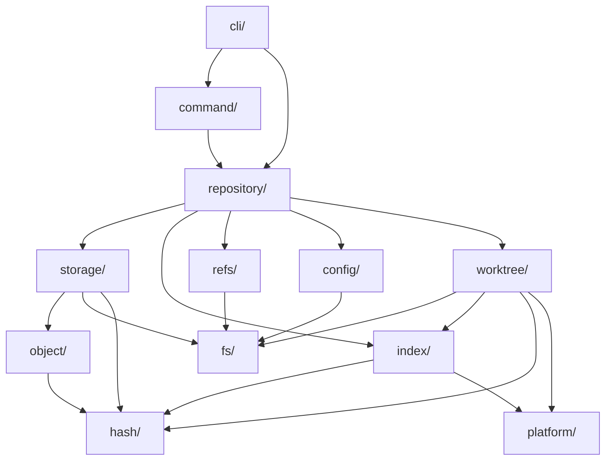
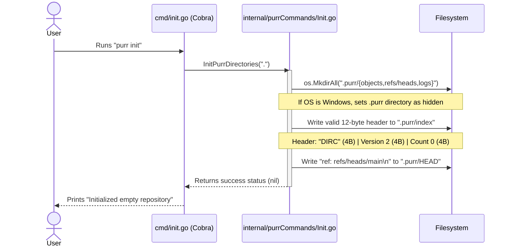
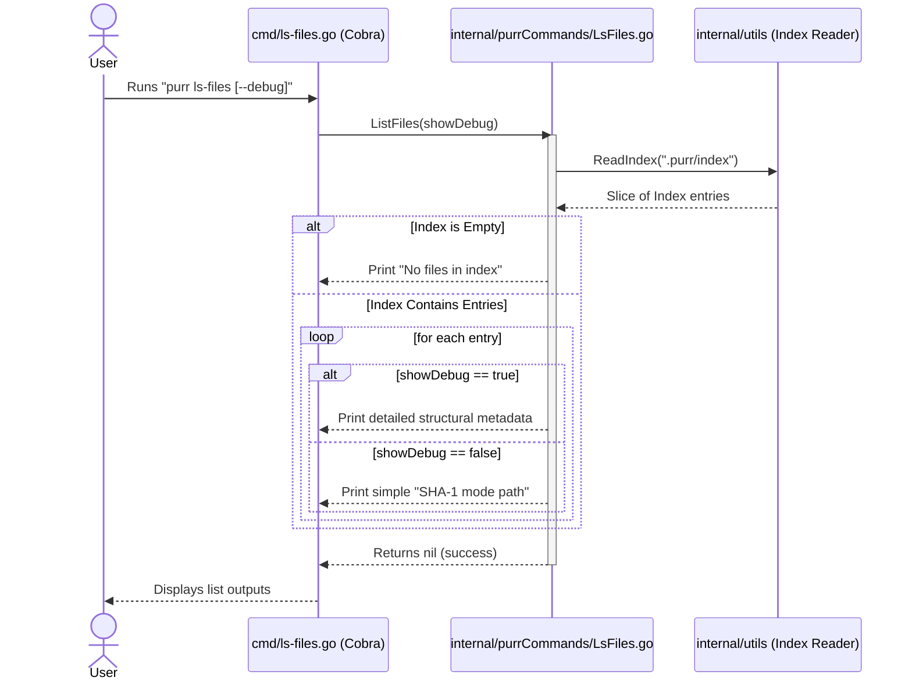
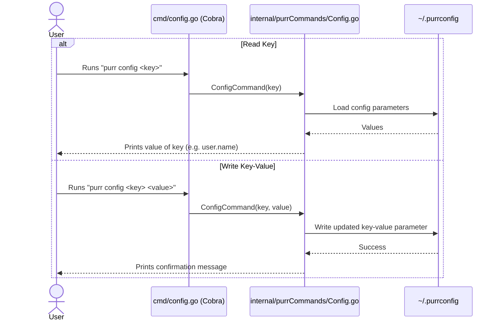
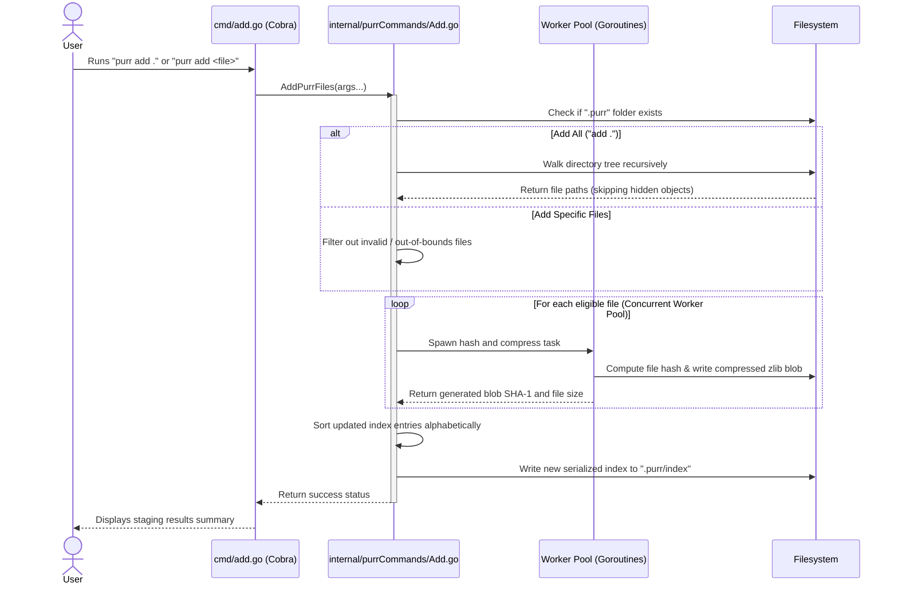
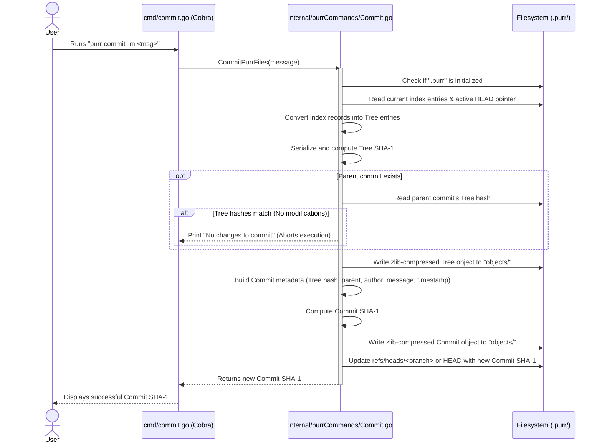

# Purr — Architecture Design & Sequence Flows

This document details the software design, sequence flows, and internal implementations of each custom **Purr** command, as well as the overarching codebase restructuring proposals.

---

## 1. What's Wrong With The Current Structure

```
internal/
├── purrCommands/        ← command logic + OS calls + concurrency + path construction + index I/O
│   ├── Add.go           ← owns goroutine pool, mutex, filepath.Join(".purr","index"), os.Stat
│   ├── Commit.go        ← owns zlib compression, tree building, HEAD resolution
│   ├── Config.go
│   ├── Init.go          ← Windows syscalls without build tags
│   └── LsFiles.go
└── utils/               ← everything else dumped here
    ├── commitFunctions.go  ← tree objects + commit objects + HEAD + branch refs + config check
    ├── config.go           ← global config I/O
    ├── index.go            ← binary index serialization
    ├── shaFunctions.go     ← blob hashing + tree hashing
    ├── types.go            ← all types for everything
    └── utils.go            ← file walk + object store + stat population + HEAD read/write
```

### Diagnosis

| Problem | Where | Why it hurts |
|---|---|---|
| **God package** | `utils/` has 6 files doing 8+ unrelated things | Can't test hashing without pulling in filesystem, HEAD, config, index |
| **No abstraction boundary** | `Add.go` directly calls `os.Stat`, `filepath.Join(".purr",...)`, `os.Getwd()` | Can't test add logic without a real filesystem |
| **Platform code mixed with core** | `utils.go:83` casts to `Win32FileAttributeData`, `Init.go` calls Windows syscalls | Won't compile cross-platform |
| **Concurrency in business logic** | `Add.go` owns goroutine pool, semaphore, mutex | Can't change concurrency strategy without editing command logic |
| **Path construction scattered** | 27 separate `filepath.Join(".purr", ...)` calls across 8 files | One rename of `.purr` requires editing every file |
| **No repository object** | Every function independently resolves paths relative to CWD | No way to operate on a repo from a subdirectory or test with a temp dir |
| **Duplicate functions** | `GetHEADCommit` / `GetParentCommit`, `UpdateHEAD` / `UpdateBranchRef` | Will inevitably drift |
| **Types for everything in one file** | `IndexEntry`, `CommitObj`, `TreeEntries`, `PurrConfig`, `Index` all in `types.go` | Index types coupled to commit types coupled to config types |

**The root cause:** There's no domain model. Code is organized by "command" vs "not command" instead of by responsibility.

---

## 2. Proposed Structure

```
Persephone/
├── cli/                             # Cobra command definitions (porcelain)
│   ├── root.go
│   ├── init.go
│   ├── add.go
│   ├── commit.go
│   ├── config.go
│   └── ls_files.go
│
├── internal/
│   ├── repository/                  # Central repo handle — the spine of the system
│   │   ├── repository.go            # Repository struct, Open(), Init(), path resolution
│   │   └── repository_test.go
│   │
│   ├── object/                      # Object model (blob, tree, commit) — pure data + serialization
│   │   ├── blob.go                  # Blob type, header format, serialize/deserialize
│   │   ├── tree.go                  # Tree type, entry sorting, binary tree format
│   │   ├── commit.go               # Commit type, text format, parent chain
│   │   ├── object.go               # Common Object interface, OID type
│   │   └── *_test.go
│   │
│   ├── storage/                     # Object database — content-addressable store
│   │   ├── backend.go              # ObjectStore interface
│   │   ├── loose.go                # Loose object read/write (.purr/objects/xx/yy)
│   │   ├── loose_test.go
│   │   └── compress.go             # zlib compress/decompress helpers
│   │
│   ├── index/                       # Staging area — binary index format
│   │   ├── index.go                # Index struct, Add/Remove/Lookup operations
│   │   ├── entry.go                # IndexEntry type + stat cache fields
│   │   ├── codec.go                # Binary serialization (read/write DIRC format)
│   │   └── *_test.go
│   │
│   ├── refs/                        # Reference management — HEAD, branches, tags
│   │   ├── refs.go                 # RefStore interface + filesystem implementation
│   │   ├── head.go                 # HEAD resolution (symbolic ref vs detached)
│   │   └── *_test.go
│   │
│   ├── worktree/                    # Working tree operations
│   │   ├── worktree.go             # Walk, diff against index, stage files
│   │   ├── ignore.go               # .purrignore pattern matching
│   │   └── status.go               # Working tree status (modified/untracked/deleted)
│   │
│   ├── config/                      # Configuration system
│   │   ├── config.go               # Config struct, read/write
│   │   └── config_test.go
│   │
│   ├── command/                     # Command implementations (plumbing)
│   │   ├── init.go                 # Init logic (no CLI, no OS awareness)
│   │   ├── add.go                  # Add logic (receives repo handle, no concurrency)
│   │   ├── commit.go               # Commit logic
│   │   └── ls_files.go
│   │
│   ├── hash/                        # Hashing abstraction
│   │   └── hash.go                 # OID type, HashObject(), currently SHA-1, swappable later
│   │
│   ├── platform/                    # ALL OS-specific code lives here
│   │   ├── stat_linux.go           # //go:build linux — Stat_t extraction
│   │   ├── stat_darwin.go          # //go:build darwin
│   │   ├── stat_windows.go         # //go:build windows — Win32FileAttributeData
│   │   ├── hidden_windows.go       # //go:build windows — SetFileAttributes
│   │   ├── hidden_unix.go          # //go:build !windows — no-op
│   │   ├── lock.go                 # File locking (fcntl on unix, LockFileEx on windows)
│   │   └── filemode.go             # Executable bit detection per platform
│   │
│   └── fs/                          # Filesystem abstraction layer
│       ├── fs.go                   # FS interface: Read, Write, Stat, MkdirAll, Rename, Lock
│       ├── osfs.go                 # Real filesystem implementation
│       ├── memfs.go                # In-memory FS for testing
│       └── atomic.go               # AtomicWrite: write-to-temp → fsync → rename
│
├── Docs/
├── Makefile
├── go.mod
└── README.md
```

---

## 3. Package Responsibilities

### Leaf packages (no internal imports)

| Package | Owns | Exports |
|---|---|---|
| `hash` | OID type, hashing algorithm | `type OID [20]byte`, `Hash([]byte) OID`, `OIDFromHex(string) OID` |
| `platform` | All `//go:build` tagged code | `ExtractStat(os.FileInfo) StatData`, `SetHidden(path)`, `AcquireLock(path)` |
| `fs` | Filesystem I/O abstraction | `type FS interface`, `NewOSFS()`, `NewMemFS()`, `AtomicWrite()` |

### Core domain packages

| Package | Owns | Imports |
|---|---|---|
| `object` | Blob/Tree/Commit **types and serialization** — no I/O | `hash` |
| `index` | IndexEntry type, binary codec, in-memory index operations | `hash`, `platform` (for stat fields) |
| `storage` | Reading/writing objects to disk | `hash`, `object`, `fs` |
| `refs` | HEAD resolution, branch pointer updates | `fs` |
| `config` | Config struct, JSON serialization, path resolution | `fs` |
| `worktree` | File walking, ignore patterns, status diffing | `fs`, `index`, `hash`, `platform` |

### Orchestration layer

| Package | Owns | Imports |
|---|---|---|
| `repository` | Repo struct that wires everything together — holds `FS`, `ObjectStore`, `Index`, `RefStore` | All core packages |
| `command` | Stateless functions that take a `*Repository` and execute plumbing logic | `repository` |

### CLI layer

| Package | Owns | Imports |
|---|---|---|
| `cli` | Cobra command definitions, flag parsing, output formatting, `os.Exit` | `command`, `repository` |

---

## 4. Dependency Rules



**Hard rules:**

1. **Nothing imports `cli/`** — it's the outermost layer
2. **`object/` does zero I/O** — pure types + serialization + hashing
3. **`command/` never calls `os.*` directly** — everything through `repository`
4. **`platform/` is never imported by `cli/` or `command/`** — only by low-level packages that need OS-specific behavior
5. **`fs/` never imports any internal package** — it's a leaf dependency
6. **No package imports `repository/` except `command/` and `cli/`** — prevents circular deps

---

## 5. Key Interfaces

```go
// fs/fs.go — abstracts all filesystem I/O
type FS interface {
    ReadFile(path string) ([]byte, error)
    WriteFile(path string, data []byte, perm os.FileMode) error
    AtomicWrite(path string, data []byte, perm os.FileMode) error  // temp+fsync+rename
    Stat(path string) (os.FileInfo, error)
    MkdirAll(path string, perm os.FileMode) error
    Remove(path string) error
    Walk(root string, fn filepath.WalkFunc) error
    Lock(path string) (Unlocker, error)   // file-based locking
}
```

```go
// storage/backend.go — object database
type ObjectStore interface {
    Read(oid hash.OID) (object.Object, error)
    Write(obj object.Object) (hash.OID, error)
    Exists(oid hash.OID) bool
}
```

```go
// refs/refs.go — reference storage
type RefStore interface {
    ReadHEAD() (string, error)               // returns ref name or OID
    ResolveHEAD() (hash.OID, error)          // follows symbolic refs
    UpdateRef(name string, oid hash.OID) error
}
```

---

## 6. Command sequence flows

### 6.1 `purr init`

Initializes a local repository with the necessary directory hierarchy and metadata configuration.



1. **Invocation**: The user executes `purr init`. The runtime invokes the entrypoint in `cmd/init.go`.
2. **Directory Bootstrapping**: Core calls `InitPurrDirectories(".")` inside `internal/purrCommands/Init.go`. It builds `.purr/objects`, `.purr/refs/heads`, and `.purr/logs`.
3. **OS-Specific Adjustments**: On Windows platforms, `.purr` is set to "hidden" using syscalls.
4. **Staging Index Creation**: Writes a valid 12-byte binary index header if the file is missing:
   - Magic signature: `"DIRC"` (4 bytes)
   - Staging Version: `2` (4 bytes, big-endian)
   - Initial count of entries: `0` (4 bytes, big-endian)
5. **HEAD Initialization**: Writes `"ref: refs/heads/main\n"` to `.purr/HEAD`, binding active tracking to the `main` branch.

### 6.2 `purr ls-files`

Lists all files currently tracked in the staging index.



1. **Loading Index**: The CLI calls `ListFiles(showDebug)` in `internal/purrCommands/LsFiles.go`. It reads the binary database under `.purr/index` using the `utils.ReadIndex` library helper.
2. **Empty Bounds Handling**: If the index contains `0` records, the command exits with `"No files in index"`.
3. **Output Rendering**:
   - **Default Mode**: Displays the calculated object hash, file mode, and relative path.
   - **Debug Mode**: Prints detailed binary index records, including timestamps (`mtime`, `ctime`), host attributes (`dev`, `ino`, `uid`, `gid`), file sizes, and stage parameters.

### 6.3 `purr config`

Manages configuration files on the local machine.



1. **Invocation**: The user executes `purr config <key> [value]`.
2. **CLI Routing**: Handles read or write modes depending on the argument length:
   - **Read Mode** (1 argument): Invokes `utils.ReadConfig()` to load the global configuration file (`~/.purrconfig`) and outputs the value of the requested key.
   - **Write Mode** (2+ arguments): Loads current configs, modifies the key, and writes changes back to `~/.purrconfig`.

### 6.4 `purr add`

Walks directories concurrently and stages new or modified files in the `.purr` index.



1. **Directory Checks**: Core calls `AddPurrFiles(args...)` from `internal/purrCommands/Add.go`, validating that the directory has been initialized with a `.purr` storage root.
2. **Workspace Traversal**:
   - **Staging All**: Walks the current directory recursively skipping hidden folders and `.purr` contents.
   - **Staging Specific Paths**: Collects the files listed in the arguments, filtering out missing or out-of-bounds files.
3. **Concurrent Hashing (Worker Pool)**: For modified or new files, tasks are distributed to a concurrent worker pool:
   - Calculates the `SHA-1` checksum of the file's raw content.
   - Writes a zlib-compressed blob object to `.purr/objects/XX/YYYY...` only if the file content has changed.
4. **Index Serialization**: Integrates new file entries, sorts the index collection alphabetically by path, and performs an atomic write to `.purr/index`.

### 6.5 `purr commit`

Generates an immutable commit snapshot containing the staged workspace states.



1. **Metadata Setup**: Extracts current stage data from `.purr/index` and fetches the parent commit reference by reading the local branch ref pointed to by `.purr/HEAD`.
2. **Tree Object Assembly**:
   - Groups index files into directory entries.
   - Serializes folders into standard Tree format entries.
   - Computes the Tree `SHA-1` hash.
3. **Deduplication Validation**: Compares the new Tree hash with the parent commit's Tree hash. If they are identical, the commit is aborted since no changes have been staged.
4. **Write Objects**:
   - Writes the compressed Tree object into the database.
   - Generates Commit metadata (Tree hash, Parent hash, Author name/email, message, and timestamp).
   - Computes the Commit `SHA-1` hash.
   - Writes the compressed Commit object into the database.
5. **Updating Refs**: Updates the target branch pointer (e.g., `.purr/refs/heads/main`) to point to the new commit's `SHA-1` hash.
