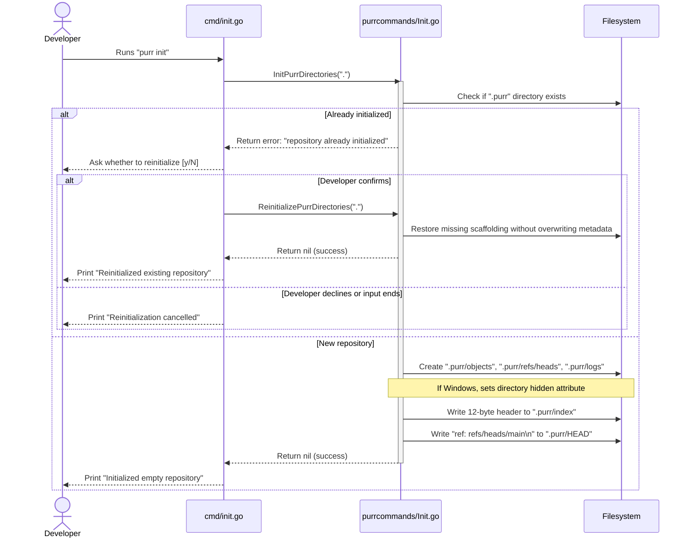
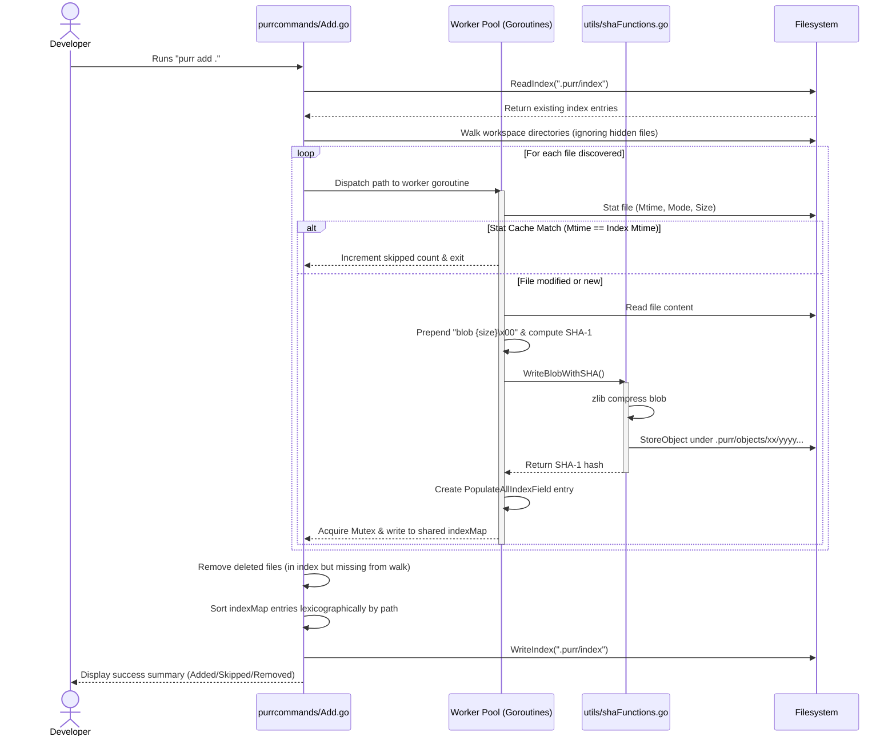
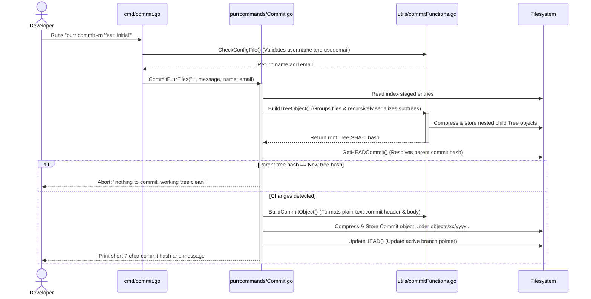
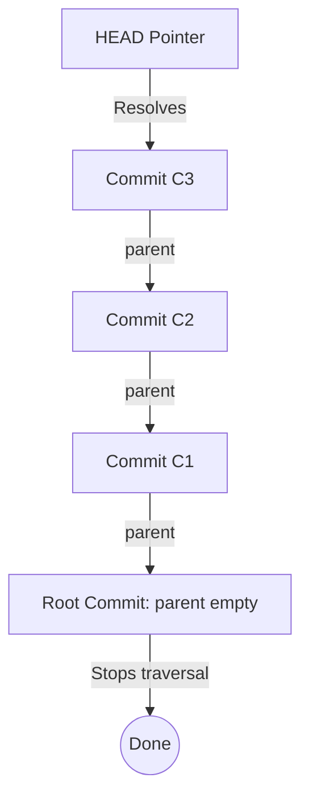

# Persephone (`purr`) Commands Reference & Execution Guide

This document serves as an exhaustive architectural reference and execution guide for each command supported by **Persephone** (the `purr` CLI tool). It explains exactly how the code runs, details why design choices were made, outlines underlying data serialization formats, and documents critical repository invariants.

---

## Table of Contents
1. [Core Architectural Foundations](#1-core-architectural-foundations)
2. [Command: `purr init`](#2-command-purr-init)
3. [Command: `purr add`](#3-command-purr-add)
4. [Command: `purr commit`](#4-command-purr-commit)
5. [Command: `purr config`](#5-command-purr-config)
6. [Command: `purr ls`](#6-command-purr-ls)
7. [Command: `purr log`](#7-command-purr-log)
8. [Summary of Serialization Formats](#8-summary-of-serialization-formats)

---

## 1. Core Architectural Foundations

Persephone is designed around three primary logical environments that mirror Git's conceptual models, implemented natively in Go:

1. **Working Directory**: The actual project workspace where files are created, modified, or deleted by the user.
2. **Staging Index (`.purr/index`)**: A binary cache tracking the exact snapshot of files prepared for the next commit. It caches filesystem `os.FileInfo` stat metadata to bypass redundant disk reading and cryptographic hashing.
3. **Object Database (`.purr/objects`)**: A content-addressable flat-file store containing zlib-compressed payloads of VCS objects:
   - **Blobs**: Compressed file contents (detached from filenames and file permissions).
   - **Trees**: Binary directory listings mapping file paths, types, modes, and child SHA-1 hashes.
   - **Commits**: Plain-text snapshot metadata structures pointing to a root Tree, Parent commit, Author/Committer credentials, and commit message.

```
                  +--------------------------------+
                  |       Working Directory        |
                  +--------------------------------+
                                  |
                                  |  purr add (hashes & stages files)
                                  v
                  +--------------------------------+
                  |  Staging Index (.purr/index)   |
                  +--------------------------------+
                                  |
                                  |  purr commit (builds tree and commit)
                                  v
                  +--------------------------------+
                  |  Object Store (.purr/objects)  |
                  +--------------------------------+
```

---

## 2. Command: `purr init`

### 2.1 Overview & CLI Usage
* **Command**: `purr init`
* **Short Description**: Bootstraps a new, empty Persephone repository.
* **CLI Entrypoint**: `cmd/init.go`
* **Core Controller**: `internal/purrcommands/Init.go:InitPurrDirectories()`

### 2.2 How the Code Works
1. **Directory Inspection**: Core checks if a `.purr` directory already exists at the requested path.
2. **Bootstrapping Structure**: It initializes the following layout using `os.MkdirAll` (directory permissions `0755`):
   - `.purr/objects`: The content-addressable object database.
   - `.purr/refs/heads`: Directory for storing branch head files (e.g. `refs/heads/main`).
   - `.purr/logs`: Directory for transaction logs (preparing for eventual reflog support).
3. **Windows Attribute Guard**: Calls `platform.SetHidden()` which, on Windows, leverages OS-specific attributes to hide the `.purr` directory (no-op on Unix/macOS).
4. **Index Bootstrapping**: Writes a valid 12-byte header to `.purr/index` (`0644` permissions) consisting of:
   - 4-byte signature: `"DIRC"` (Directory Cache)
   - 4-byte version: `2` (Big-Endian uint32)
   - 4-byte entry count: `0` (Big-Endian uint32)
5. **HEAD Pointer Initialization**: Generates `.purr/HEAD` pointing symbolically to the default branch (`ref: refs/heads/main\n`).



### 2.3 Design Decisions (Why we do it this way)
* **Explicit Reinitialization Invariant**: If `.purr` exists, initial setup stops before touching files and the CLI asks for confirmation. If accepted, reinitialization restores missing scaffolding while preserving index, HEAD, refs, and objects.
* **Pre-Seeded 12-Byte Staging Index**: The VCS requires a valid index format to stage files. To prevent subsequent commands (`purr add`, `purr ls`) from crashing or failing on an empty index file, the index is pre-seeded with a valid 12-byte binary header matching standard Git index version 2.

---

## 3. Command: `purr add`

### 3.1 Overview & CLI Usage
* **Command**: `purr add <file|dir|.>`
* **Short Description**: Stages files by updating their contents in the object store and recording metadata in the index.
* **CLI Entrypoint**: `cmd/add.go`
* **Core Controller**: `internal/purrcommands/Add.go:AddPurrFiles()`
  - Routes to `addAllPurrFiles()` for bulk staging (`purr add .`).
  - Routes to `addSpecificPurrFiles()` for targeted paths.

### 3.2 How the Code Works
1. **Integrity Check**: Verifies that the `.purr` directory exists.
2. **Index Loading**: Reads `.purr/index` into an in-memory map keyed by relative file paths.
3. **Traversal (Staging All)**: Recursively crawls the repository root using `utils.WalkAndAddFiles()`, skipping hidden files/directories (any path component starting with `.`).
4. **Concurrency-First Worker Pool**: Spawns dynamic worker goroutines bounded by a semaphore channel of size `runtime.NumCPU() * 5`.
5. **Stat Cache Evaluation (Stat Bypass)**: For each file:
   - Retrieves filesystem `os.FileInfo` metadata.
   - Compares the file's modification time (`ModTime`) with the cached `Mtime` in the loaded index map.
   - If they are equal, it increments the skipped count and exits the goroutine, bypassing disk I/O and hashing.
6. **Object Compression & Storage**: If modified or new:
   - Reads file content, prepends standard Git-style header (`blob {size}\x00`), and computes the SHA-1 checksum.
   - Compresses the payload via standard `zlib` writer.
   - Stores it using `utils.StoreObject()`, which handles directory fan-out: `.purr/objects/{SHA1[:2]}/{SHA1[2:]}`.
7. **Thread-Safe Map Updates**: The main goroutine coordinates writing to the shared `indexMap` and recording errors to `processingErrs[]` using a `sync.Mutex` around critical sections.
8. **Sorting and Serialization**: Converts the index map to a slice, sorts it lexicographically by path, and writes the byte array back to `.purr/index`.



### 3.3 Design Decisions (Why we do it this way)
* **`runtime.NumCPU() * 5` Worker Limit**: Hashing files and compressing data is heavily disk I/O bound. Multiplexing multiple workers per logical CPU core ensures that while some workers block on disk read/write, others compute SHA-1 hashes or process system memory, maximizing throughput.
* **Stat Cache Bypass**: Hashing massive files repeatedly degrades performance. Comparing filesystem `ModTime` directly against the cached index time turns workspace scans into a near-instant $O(N)$ filesystem stat traversal.
* **Hidden File Guard**: `WalkAndAddFiles` skips any file or folder starting with a dot (`.`). This is a critical security safeguard that prevents staging the `.purr` repository itself, parent repositories, IDE config folders (`.vscode`, `.idea`), or local configuration configurations (like `.env`).
* **Lexicographical Index Sorting**: Storing entries sorted alphabetically is an absolute VCS format invariant. It ensures deterministic binary output (generating byte-for-byte identical files across different runs) and permits binary search optimizations ($O(\log N)$) during tree resolution and status diff checks.

---

## 4. Command: `purr commit`

### 4.1 Overview & CLI Usage
* **Command**: `purr commit -m "<message>"`
* **Short Description**: Takes a permanent snapshot of the staging area as a commit object.
* **Flags**:
  - `-m, --message`: Specifies the commit message (required).
* **CLI Entrypoint**: `cmd/commit.go`
* **Core Controller**: `internal/purrcommands/Commit.go:CommitPurrFiles()`

### 4.2 How the Code Works
1. **Pre-flight Config Check**: Validates that global user configurations `user.name` and `user.email` are set in `~/.purrconfig`. If missing, aborts with a stylized warning and actionable setup commands.
2. **Load Index**: Reads staged entries from `.purr/index`.
3. **Build Recursive Trees**:
   - Converts the flat list of staging paths into structured `TreeEntries`.
   - Groups files recursively by directory components.
   - For subdirectories, calls `BuildTreeObject()` to serialize their contents into child tree payloads.
   - Hashes and writes child trees to `.purr/objects/xx/yyyy...` using `utils.StoreObject()`.
   - Incorporates the subdirectory node back into the parent tree with directory mode `040000`.
   - Generates the root Tree object, hashes it, and stores the compressed payload.
4. **Prevent Empty Commits**:
   - Resolves the active HEAD commit hash.
   - Extracts the parent commit's root tree SHA-1.
   - Compares the parent tree hash with the newly generated tree hash. If they are identical, aborts with `"nothing to commit, working tree clean"`.
5. **Serialize Commit Metadata**:
   - Populates a `CommitObj` containing: `TreeHash`, `ParentHash`, `Author` credentials, `Committer` credentials, `Timestamp` (`time.Now()`), and `Message`.
   - Computes the SHA-1 of the plain-text commit payload.
   - Compresses the commit payload via zlib and stores it under `.purr/objects`.
6. **Advance HEAD**: Overwrites the symbolic branch ref file pointed to by `.purr/HEAD` with the new 40-character commit SHA-1, advancing the branch.



### 4.3 Design Decisions (Why we do it this way)
* **Recursively Segmented Tree Packing**: Standard Git directories are not flat; they form a hierarchical tree. Persephone splits flat index paths (e.g. `pkg/db/conn.go`) into subdirectories (`pkg`, `db`) and builds distinct sub-tree database nodes. This allows partial matching and deduplication: if only one subdirectory changes, other subtrees retain identical SHA-1 hashes, minimizing disk overhead.
* **Tree Sorting `/` Virtual Suffix**: During sorting, sub-trees (directories) are compared as if they had a trailing slash `/` appended (e.g., `src/` sorts after `src.go`). This conforms exactly to Git's tree-ordering rules, ensuring that Persephone's generated tree hashes are perfectly Git-compatible.
* **Parent Tree Compare Guard**: Comparing the current root tree hash to the parent commit's tree hash provides an $O(1)$ change-detection mechanism. It prevents the creation of redundant commits that do not alter the code state.
* **Deterministic UTC Timezones**: While developers work in various time zones, commit timestamps are serialized using a hardcoded `+0000` (UTC) offset representation. This eliminates timezone discrepancies during cross-platform testing, guaranteeing deterministic object hashes across different development systems.

---

## 5. Command: `purr config`

### 5.1 Overview & CLI Usage
* **Command**: `purr config <key> [<value>]`
* **Short Description**: Gets or sets options in the global configuration file.
* **Examples**:
  - `purr config user.name`
  - `purr config user.name "Alice Smith"`
* **CLI Entrypoint**: `cmd/config.go`
* **Core Controller**: `internal/purrcommands/Config.go:ConfigCommand()`

### 5.2 How the Code Works
1. **Routing**:
   - **Zero arguments**: Reads the configuration file and prints both `user.name` and `user.email`. If either is missing, it alerts the developer with error cues.
   - **One argument**: Routes to `readConfig(key)`. Loads `~/.purrconfig`, matches the key, and prints the result.
   - **Two or more arguments**: Joins all arguments after the key with spaces (reconstructing unquoted values) and routes to `writeConfig(key, value)`.
2. **JSON Serialization**: Loads and writes the configuration payload from/to the global location `~/.purrconfig` using standard Go JSON encoding (`json.MarshalIndent`).

### 5.3 Design Decisions (Why we do it this way)
* **Single JSON Global Location**: Instead of parsing complex `.gitconfig` INI formats or tracking per-repository config files, Persephone centralizes user credentials in a single global JSON file (`~/.purrconfig`) in the user's home directory. This simplifies identity configuration across multiple development directories.
* **Unquoted Multi-Word Key Support**: If a developer forgets quotes (e.g., `purr config user.name John Doe`), `strings.Join(args[1:], " ")` automatically merges the remaining command-line arguments. This prevents invalid key-value parses and provides a more forgiving user experience.

---

## 6. Command: `purr ls`

### 6.1 Overview & CLI Usage
* **Command**: `purr ls [--debug]`
* **Short Description**: Lists all files currently staged in the index.
* **Flags**:
  - `-d, --debug`: Displays low-level stat cache metadata of each staged file.
* **CLI Entrypoint**: `cmd/ls.go`
* **Core Controller**: `internal/purrcommands/Ls.go:ListFiles()`

### 6.2 How the Code Works
1. **Repository Verification**: Assures `.purr` exists.
2. **Read Index**: Reads `.purr/index` to parse staged records. If the index is empty, prints `"No files staged"` and returns.
3. **Rendering Modes**:
   - **Standard Mode (Default)**: Formats a clean list showing file paths, short 7-character SHA-1 prefixes, and standard octal file permissions (e.g., `100644`).
   - **Debug Mode (`--debug`)**: Dumps the complete in-memory `IndexEntry` struct data for each file, including `Ctime`, `Mtime`, `Dev`, `Ino`, `Mode`, `UID`, `GID`, `Size`, and conflict `Stage` number.

### 6.3 Design Decisions (Why we do it this way)
* **Octal File Modes**: Renders permissions in standard octal representation (`%06o`), matching the formatting used by standard Unix filesystem tools and `git ls-files`.
* **VCS Maintainer Debug Mode**: The `--debug` flag exposes the active stat cache data. This serves as a vital diagnostic tool for testing platform-specific stat collections (e.g., verifying that Windows `ExtractStat` is populating inodes and device IDs correctly) and confirming stat-bypass behavior.

---

## 7. Command: `purr log`

### 7.1 Overview & CLI Usage
* **Command**: `purr log`
* **Short Description**: Shows the linear history of commits starting from HEAD.
* **CLI Entrypoint**: `cmd/log.go`
* **Core Controller**: `internal/purrcommands/Log.go:LogCommits()`

### 7.2 How the Code Works
1. **Resolve HEAD**: Calls `utils.GetHEADCommit()` to locate the latest tip commit hash. If no commits exist, outputs `"No commits yet"` and exits.
2. **ancestry Traversal Loop**:
   - Sets up a loop running as long as the current `commitHash` is not empty.
   - Employs a `visited` hash map (`map[string]struct{}`) to track walked commits.
   - If the current hash has already been visited, aborts with a cyclic history error.
   - Loads the compressed commit object from `.purr/objects/{hash[:2]}/{hash[2:]}` using `utils.ReadCommitObject()`.
   - Parses the decompressed headers and commit message body.
   - Outputs formatted commit information (full commit hash, author details, UTC date, and commit message).
   - Reassigns the current `commitHash` to the commit's `ParentHash` to walk backward in history.



### 7.3 Design Decisions (Why we do it this way)
* **Loose Object Parsing Verification**: Commits share the loose object database with blob and tree nodes. To prevent treating non-commit objects as commit history during traversal, `ReadCommitObject` strictly validates the object header envelope (`commit <size>\x00`) and verifies that required metadata fields exist before following any parent pointers.
* **Visited Set Cycle Protection**: A corrupted parent pointer could point back to a descendant commit, creating an infinite ancestor loop. Tracking visited hashes guarantees that cycles are caught instantly, aborting execution safely rather than hanging the CLI tool.

---

## 8. Summary of Serialization Formats

### 8.1 Staging Index File Format (`.purr/index`)
The index uses a binary layout inspired by Git's index version 2. All binary values are serialized in **Big-Endian** order to ensure cross-platform portability.

| Field | Size | Data Type | Description |
|---|---|---|---|
| **Signature** | 4 Bytes | `[]byte` | `"DIRC"` (Directory Cache magic) |
| **Version** | 4 Bytes | `uint32` | Format version (must be `2`) |
| **Entry Count** | 4 Bytes | `uint32` | Total number of staged records |
| **Ctime (Seconds)** | 8 Bytes | `int64` | File status metadata modification time |
| **Mtime (Seconds)** | 8 Bytes | `int64` | File content modification time |
| **Dev** | 4 Bytes | `uint32` | Device identifier |
| **Ino** | 4 Bytes | `uint32` | Inode number |
| **Mode** | 4 Bytes | `uint32` | Unix permissions and file type |
| **UID** | 4 Bytes | `uint32` | Owner user ID |
| **GID** | 4 Bytes | `uint32` | Owner group ID |
| **Size** | 4 Bytes | `uint32` | File content size in bytes |
| **SHA-1** | 20 Bytes | `[20]byte` | Raw binary SHA-1 checksum of staged blob |
| **Stage Flags** | 2 Bytes | `uint16` | Staging stage (0 = standard, 1-3 = conflicts) |
| **Path Length** | 2 Bytes | `uint16` | Length of the relative path string |
| **Path** | Variable | `[]byte` | Relative file path (e.g. `src/main.go`) |
| **Padding** | 0-7 Bytes | `[]byte` | Null-bytes aligning the next entry to an 8-byte boundary |

---

### 8.2 Loose Blob Object Format
Stored compressed under `.purr/objects/xx/yyyy...`

```
blob {size}\x00{raw content bytes}
```

---

### 8.3 Loose Tree Object Format
Stored compressed under `.purr/objects/xx/yyyy...`

```
tree {size}\x00{mode} {name}\x00{20-byte binary SHA-1}{mode} {name}\x00{20-byte binary SHA-1}...
```
*Note: Entries are sorted alphabetically by `name` (with a virtual `/` appended to the comparison string if the entry represents a directory/subtree).*

---

### 8.4 Loose Commit Object Format
Stored compressed under `.purr/objects/xx/yyyy...`

```
commit {size}\x00tree {tree-hash}
[parent {parent-hash}]
author {name} <{email}> {timestamp} +0000
committer {name} <{email}> {timestamp} +0000

{commit message}
```
*Note: The parent line is omitted in the root commit of the repository. The single blank line (`\n\n`) is the required separator between metadata headers and the commit message.*
